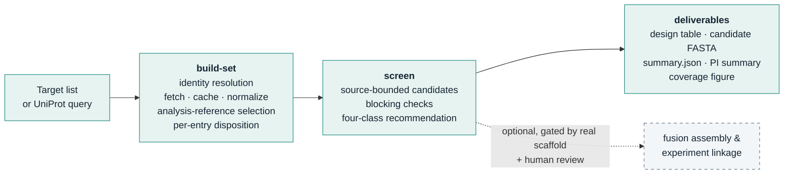

# ECD–SNIPR Harness

**Evidence-bounded antigen-fragment design for SNIPR receivers — at the scale of the human membrane proteome.**

[](https://github.com/KaixuanLi-sibcb/ecd-snipr-harness/actions/workflows/ci.yml)
[](LICENSE)
[](pyproject.toml)
[](CHANGELOG.md)

`ecd-snipr-harness` turns *"a new membrane target arrived — which fragment should we use, and why?"* into a batch-executable, fully traceable pipeline. Every target gets a concrete candidate fragment (coordinates · sequence · rationale · open issues), a four-class screening recommendation, and a reconciled coverage summary across the whole set.

Working configuration: **Antibody-Sender → Antigen-Receiver** — the antibody sits on the sender cell; the antigen fragment occupies the antigen-recognition position of the SNIPR receiver. The tool designs the *fragment*, not the antibody, and not the sender construct.

## Pipeline



Each reference is classified by a transparent decision table — no composite scores:

| Recommendation | Meaning |
|---|---|
| **standard_candidate** | A routine candidate with positive sequence/topology/boundary evidence |
| **conditional_candidate** | A sourced candidate exists, but specific issues (orientation, processing, domain cut, multichain partner, boundary conflict, …) need verification |
| **no_standard_route** | No routine design under current routes — a route limitation, not a verdict on the protein |
| **insufficient_evidence** | Core identity/topology/boundary evidence is missing — an evidence state, not a failure |

Out-of-scope objects (`scope_status`) and technical failures (`processing_status`) are tracked separately; nothing is silently dropped. Missing epitope or risk literature is reported as *not evaluated* — it never silently downgrades a well-bounded candidate.

## Candidate rules by topology

| Topology | Treatment |
|---|---|
| Type I | Full continuous ectodomain, mature form (signal peptide / propeptide removed) |
| Type II | Same, plus an orientation flag for receiver attachment |
| GPI-anchored | Mature-form boundaries checked; omega residue retained, GPI signal peptide removed |
| Multi-pass | Extracellular loops are **never stitched**; only sourced external domains may be conditional alternates |
| Shed / processed | Sourced processed forms may serve as alternates; fuzzy secondary annotations are deferred, not silently used for blocking |

Blocking checks (coordinate errors, retained native TM/SP/cytoplasmic tail) stay hard failures. Length, cysteine count and glycosylation motifs are warnings, not thresholds.

## Quickstart

Python ≥ 3.10, standard library only — no dependencies, no GPU, no network needed for the test suite.

```bash
# Offline synthetic smoke test
python3 scripts/ecd_snipr_cli.py smoke --outdir /tmp/ecd_smoke

# Screen a target list (accessions or gene names; every row preserved)
python3 scripts/ecd_snipr_cli.py screen --list examples/target_list_example.tsv \
    --cache cache --outdir runs/pilot --pilot

# Build a defined set from a public UniProt query, then screen it
python3 scripts/ecd_snipr_cli.py build-set \
    --query '(organism_id:9606) AND (reviewed:true) AND (keyword:"Membrane" OR keyword:"Cell membrane")' \
    --cache cache --outdir sets/human_membrane
python3 scripts/ecd_snipr_cli.py screen --set sets/human_membrane --outdir runs/human_membrane
```

Incomplete retrievals are marked `partial` and never reported as complete; `--resume` continues interrupted batches from the content-addressed cache. Optional lab-experience rules (`--lab-rules`) may annotate or downgrade a recommendation — never upgrade; when absent, outputs state *not yet incorporated*.

## Outputs

| File | Content |
|---|---|
| `protein_screening.tsv` | One row per analysis object: scope, topology, class, primary candidate, rationale, risks, missing info |
| `candidate_plan.tsv` / `candidates.json` | Primary + alternate candidates: coordinates, length, sequence, rationale |
| `candidate_fragments.fasta` | Fragment sequences (labelled `UNVALIDATED`) with junction notes |
| `summary.json` | Set definition, completeness, per-unit counts, all ratios with explicit denominators |
| `PI_SUMMARY.md` | Conclusion-first one-page summary |
| `screening_overview.svg` (+ source data) | Disposition flow and topology × class coverage |

## What it does not do

- **No success prediction.** Screening coverage ≠ functional validation; expression, recognition, basal activity and induced response remain separate experiments.
- **No fabricated constructs.** Without a real, human-reviewed SNIPR scaffold, only fragments and junction notes are delivered.
- **No heavy machinery in the batch pass.** Fully deterministic first pass; no per-protein LLM reasoning, no AlphaFold/ESM, no paid APIs.

## Development

```bash
python3 -m unittest discover -s tests -p 'test_*.py'   # 159 checks
python3 scripts/manage_skill.py validate               # contract + privacy audit
python3 scripts/manage_skill.py privacy-check
```

```
scripts/ecd_snipr/   core package — acquisition · screening · design · reporting · provenance
scripts/             CLI + packaging/privacy tooling
schemas/ references/ examples/ tests/ agents/
```

Runs are content-addressed and checksummed (`verify-run` re-checks every artifact). Raw workbooks, private construct sequences and experimental results are private research data — they live outside the package and are excluded from every release by an allowlist plus automated audits. This repository contains code, schemas, documentation and synthetic/public examples only.

## License

MIT — see [LICENSE](LICENSE).
