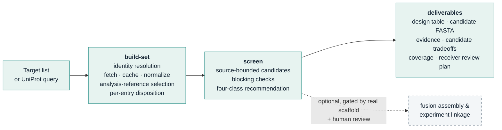

# ECD–SNIPR Harness

**Evidence-bounded antigen-fragment design for SNIPR receivers — at the scale of the human membrane proteome.**

[](https://github.com/KaixuanLi-sibcb/ecd-snipr-harness/actions/workflows/ci.yml)
[](LICENSE)
[](pyproject.toml)
[](CHANGELOG.md)

`ecd-snipr-harness` turns *"a new membrane target arrived — which fragment should we use, and why?"* into a batch-executable, traceable pipeline. Every input gets an explicit disposition. Where the sequence and annotations support a design, the output includes concrete candidate fragments (coordinates, sequence, rationale and open issues), a screening recommendation, and a reconciled set-level summary. Unsupported or unresolved inputs remain visible rather than receiving invented fragments.

Working configuration: **Antibody-Sender → Antigen-Receiver** — the antibody sits on the sender cell; the antigen fragment occupies the antigen-recognition position of the SNIPR receiver. The tool designs the *fragment*, not the antibody, and not the sender construct.

## Pipeline



Each reference is classified by a transparent decision table — no composite scores:

| Recommendation | Meaning |
|---|---|
| **standard_candidate** | A routine candidate with positive sequence/topology/boundary evidence |
| **conditional_candidate** | A sourced candidate exists, but specific issues (orientation, processing, domain cut, multichain partner, boundary conflict, …) need verification |
| **no_standard_route** | No routine design under current routes — a route limitation, not a verdict on the protein |
| **insufficient_evidence** | Core identity/topology/boundary evidence is missing — an evidence state, not a failure |

Out-of-scope objects (`scope_status`) and technical failures (`processing_status`) are tracked separately; nothing is silently dropped. Missing epitope or risk literature is reported as *not evaluated* — it never silently downgrades a well-bounded candidate.

## What changed in v0.5.0

- **Design advice and evidence are separate.** Reference, boundary, topology and domain evidence retain their sources and ECO codes. A reviewed UniProt entry is not necessarily experimentally supported at every feature; even a `standard_candidate` may have prediction-supported boundaries.
- **Primary selection records the tradeoffs.** Among unblocked candidates, prefer no annotated domain/disulfide disruption, then no mapped epitope loss, then the complete mature form, with a stable ID tie-break. Warning counts, length and glycosylation motifs are not a composite score. Unknown epitopes do not demonstrate preserved recognition.
- **Missing evidence is distinguished from a route limitation.** Route diagnostics identify missing/conflicting core annotations, unsupported routes, blocked proposals, exclusions and technical errors.
- **Receiver review is explicit.** Candidate comparison, receiver-specific verification plans and a deterministic stratified review queue accompany the fragments. A pending review is neither human approval nor an accuracy estimate.
- **Reference handling is corrected.** Displayed isoform IDs or an explicit canonical marker replace a guessed `-1`; foreign-isoform coordinates are preserved but not applied to the selected sequence. Public analysis-reference selection does not confirm the laboratory's isoform.

See the [methodology and decision contract](references/methodology-v050.md) and [reference/annotation audit](references/audit-v042.md).

## Candidate rules by topology

| Topology | Treatment |
|---|---|
| Type I | Full continuous ectodomain, mature form (signal peptide / propeptide removed) |
| Type II | Same, plus an orientation flag for receiver attachment |
| GPI-anchored | Mature-form boundaries checked; omega residue retained, GPI signal peptide removed |
| Multi-pass | Extracellular loops are **never stitched**; only sourced external domains may be conditional alternates |
| Shed / processed | Sourced processed forms may serve as alternates; fuzzy secondary annotations are deferred, not silently used for blocking |

Blocking checks (coordinate errors, retained native TM/SP/cytoplasmic tail) stay hard failures. Length, cysteine count and glycosylation motifs are warnings, not thresholds.

## Quickstart

Python ≥ 3.10, standard library only — no dependencies, no GPU, no network needed for the test suite.

```bash
# Offline synthetic smoke test
python3 scripts/ecd_snipr_cli.py smoke --outdir /tmp/ecd_smoke

# Screen a target list (accessions or gene names; every row preserved)
python3 scripts/ecd_snipr_cli.py screen --list examples/target_list_example.tsv \
    --cache cache --outdir runs/pilot --pilot

# Build a defined set from a public UniProt query, then screen it
python3 scripts/ecd_snipr_cli.py build-set \
    --query '(organism_id:9606) AND (reviewed:true) AND (keyword:"Membrane" OR keyword:"Cell membrane")' \
    --cache cache --outdir sets/human_membrane
python3 scripts/ecd_snipr_cli.py screen --set sets/human_membrane --outdir runs/human_membrane
```

Incomplete retrievals are marked `partial` and never reported as complete; `--resume` continues interrupted batches from the content-addressed cache. Optional lab-experience rules (`--lab-rules`) may annotate or downgrade a recommendation — never upgrade; when absent, outputs state *not yet incorporated*.

## Outputs

| File | Content |
|---|---|
| `protein_screening.tsv` | One row per analysis object: scope, topology, class, primary candidate, rationale, risks, missing info |
| `candidate_plan.tsv` / `candidates.json` | Primary + alternate candidates: coordinates, length, sequence, rationale |
| `candidate_fragments.fasta` | Fragment sequences (labelled `UNVALIDATED`) with junction notes |
| `summary.json` | Set definition, completeness, per-unit counts, all ratios with explicit denominators |
| `PI_SUMMARY.md` | Conclusion-first one-page summary |
| `screening_overview.svg` (+ source data) | Disposition flow and topology × class coverage |
| `candidate_comparison.tsv` | Primary/alternate relationship and explicit structural/epitope tradeoffs |
| `receiver_review_plan.tsv` | Actual scaffold, attachment orientation, recognition and processing checks still needed |
| `manual_review_queue.tsv` | Stratified pending review records; four experimental endpoints remain separate |

## Validation status

The v0.5.0 run on **2026-09-20** completed the declared **UniProtKB 2026_03 human reviewed membrane-related query**: **7,783 reference entries**, **7,746 unique gene labels**, **zero technical failures**. Query membership was checked live; public entry annotations retrieved on 2026-09-18 were checksum-verified and normalized again with v0.5.0. This is not a census of all unreviewed proteins or every isoform.

| Disposition | Reference entries |
|---|---:|
| Standard candidate | 566 |
| Conditional candidate | 1,243 |
| No supported route under current annotations | 1,597 |
| Insufficient core evidence | 2,289 |
| Outside the declared design scope | 2,088 |
| **Total queried references** | **7,783** |

The design denominator is **5,695 references**, reported separately as **5,349 core membrane references** and **346 secreted-extension references**. **1,809 references** have a primary candidate; **2,105 unblocked fragments** were exported from **2,129 candidate records**. References and candidate fragments are different counting units. These are **candidate-design coverage counts, not experimental success rates**.

Local verification passed **200 unit tests**, the offline validation/smoke/privacy/package suite and **23 independent full-run integrity and sequence checks**. **All 1,809 primary candidates lack mapped epitope evidence in this run**; 31 have annotated domain/disulfide boundary concerns. The 93-row stratified queue is still pending review. No complete receptor fusions or experimental endpoint labels were produced. One nonblocking reason-code formatting issue is documented in the [public-run record](references/public-run-v050.md).

Only aggregate public-data results and reproducibility metadata are published here. Full runs, annotation caches, private source workbooks and institutional outputs are excluded from Git.

## What it does not do

- **No success prediction.** Screening coverage ≠ functional validation; expression, recognition, basal activity and induced response remain separate experiments.
- **No fabricated constructs.** Without a real, human-reviewed SNIPR scaffold, only fragments and junction notes are delivered.
- **No heavy machinery in the batch pass.** Fully deterministic first pass; no per-protein LLM reasoning, no AlphaFold/ESM, no paid APIs.

## Development

```bash
python3 -m unittest discover -s tests -p 'test_*.py'   # 200 checks
python3 scripts/manage_skill.py validate               # contract + privacy audit
python3 scripts/manage_skill.py privacy-check
make all-checks-offline                                # validate, smoke, 200 tests, privacy, package
```

```
scripts/ecd_snipr/   core package — acquisition · screening · design · reporting · provenance
scripts/             CLI + packaging/privacy tooling
schemas/ references/ examples/ tests/ agents/
```

Runs are content-addressed and checksummed (`verify-run` re-checks every artifact). Private source workbooks, construct sequences and experimental results must stay outside the release allowlist. Automated path/credential checks are supplemented by a reviewed publication diff; they cannot guarantee detection of unpublished biology embedded in arbitrary text. This repository contains code, schemas, documentation and synthetic/public examples only.

## Installation and migration

```bash
make all-checks-offline
make install-user
```

Installation validates a staged copy and backs up an existing installation before replacement. It is a separate action, not a side effect of screening. Before reusing old data, rebuild normalized inputs from the preserved public raw cache with the current parser, then screen into a **new** output directory. Screening an old normalized set does not apply the v0.4.2 reference corrections. Preserve historical run bundles and do not reuse old assembly approvals across changed inputs or code.

## Limits and next validation

- The declared query includes organelle, multi-pass and incompletely annotated entries; membership is not evidence of natural cell-surface accessibility.
- Annotation and lexical context checks are not structural simulations or experimentally calibrated SNIPR predictors. Missing data is not negative evidence.
- A complete mature fragment can still require processing, a structural partner, specific presentation or a different receiver geometry. Shortening a fragment can lose potential antibody epitopes.
- Actual receiver scaffold/version, junction configuration and experimental isoform confirmation remain separate prerequisites for reviewed fusion export. Sender PDGFR-LC modules cannot fill those gaps.
- Surface expression, recognition retention, basal activation and induced response must be measured and associated with a specific construct, sender/antibody and assay context.

The next step is independent review of the stratified cases and prospective four-endpoint validation, not a larger uncalibrated success score.

## License

MIT — see [LICENSE](LICENSE).
