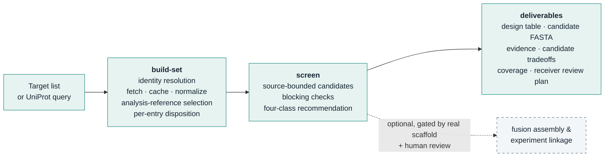

# ECD–SNIPR Harness

**Evidence-bounded antigen-fragment design for SNIPR receivers — at the scale of the human membrane proteome.**

[](https://github.com/KaixuanLi-sibcb/ecd-snipr-harness/actions/workflows/ci.yml)
[](LICENSE)
[](pyproject.toml)
[](CHANGELOG.md)

`ecd-snipr-harness` turns *"a new membrane target arrived — which fragment should we use, and why?"* into a batch-executable, traceable pipeline. Every input gets an explicit disposition. Where the sequence and annotations support a design, the output includes concrete candidate fragments (coordinates, sequence, rationale and open issues), a screening recommendation, and a reconciled set-level summary. Unsupported or unresolved inputs remain visible rather than receiving invented fragments.

Working configuration: **Antibody-Sender → Antigen-Receiver** — the antibody sits on the sender cell; the antigen fragment occupies the antigen-recognition position of the SNIPR receiver. The tool designs the *fragment*, not the antibody, and not the sender construct.

## Mechanism-priority triage (v0.8.1)

v0.8.1 also recognizes the generic `self-ligand` annotation alias, with negation
checks. This parser-coverage correction was made after a developmental case audit;
the initial frozen output is preserved. It is not evidence of held-out prediction.

The pipeline now asks a second, independent question: **which proposed fragments
have specific annotation or sequence reasons to prioritize receiver-context checks?**
It does not read laboratory failure labels, change supported ECD coordinates or
reinterpret `standard_candidate` as a low-background receiver.

| Review priority | Basis, not a measured functional outcome |
|---|---|
| `elevated_review_priority` | Retained annotated processing/interchain association or structural-unit disruption; explicit native extracellular self-association of a full interval |
| `context_dependent_review` | Unlocalized native shedding/association, glycan/immunoglobulin ligand context, or a hash-bound topology-prediction conflict |
| `sequence_alert_only` | Local hydropathy, composition or complexity descriptor; never sufficient for high functional risk |
| `no_specific_signal_detected` | No supported signal from methods actually run; **not a negative result or low risk** |
| `not_assessed` | Blocked design, invalid sequence or reference conflict |

`receiver_risk.tsv` and `receiver_risk_signals.tsv` record priorities, endpoint-specific
checks, native-versus-fragment scope, exact source text, coordinates and excluded
evidence. `receiver_risk_summary.json` reports candidate denominators and flag
prevalence. All functional confidence remains unestablished without a separately
validated protocol. Mechanistic priorities are uncalibrated hypotheses, not a
self-activation classifier. Cases already seen in development are not held-out data.

```bash
python3 scripts/ecd_snipr_cli.py receiver-risk --run-dir /path/to/verified/run \
  --reference-set /path/to/analysis-set --outdir /path/to/private/risk-overlay --resume
python3 scripts/ecd_snipr_cli.py sequence-tools --run-dir /path/to/verified/run \
  --outdir /path/to/new/sequence-tool-output --biopython
```

Core local descriptors require only the standard library. Optional
`pip install '.[sequence-tools]'` enables pinned Biopython ProtParam properties and
an independent hydropathy cross-check, not SNIPR prediction. Normalized local
IUPred/DeepTMHMM/SignalP evidence can be supplied to `receiver-risk --tool-evidence`;
missing tools stay `not_run`, mismatched hashes/coordinates are rejected. No tool
is auto-installed, and no private sequence is uploaded. Read the
[risk rules, software scope and validation plan](references/receiver-risk-v080.md).

## Fragment design is not receiver function

**v0.7.0 adds an independent receiver-function evidence layer.** A `standard_candidate`
is a supported fragment design, not a low-background or functionally compatible receiver.
`conditional_candidate` is not a prediction of failure. Neither class is a functional risk label.

Every candidate now carries four separate endpoint evidence states: surface expression,
recognition retention, basal activation and induced response. Without applicable measurements,
functional risk is `undetermined_not_low_risk`. Even eligible measurements are not converted
into success/failure without a separately defined acceptance protocol and independent validation.

- `receiver_function.tsv`: four rows per candidate, raw measurement provenance, context, unresolved links and next actions.
- `receiver_mechanism_review.tsv`: sourced or heuristic review questions, never mechanistic failure predictions.
- `RECEIVER_FUNCTION.md`: concise interpretation and claim limits; `PI_SUMMARY.md` leads with the two-layer distinction.
- Generic glycosylation/missing-evidence warnings cannot count as predicted failure hits. No gene blacklist, fitted threshold or risk-count score is added.

Both `screen` and `run` export this layer automatically. To review an existing frozen run
without rescreening or editing its results:

```bash
python3 scripts/ecd_snipr_cli.py receiver-audit --run-dir /path/to/verified/run \
  --outdir /path/to/private/receiver-audit --resume
python3 scripts/ecd_snipr_cli.py verify-run --run-dir /path/to/new/audit/bundle
```

Read the [receiver-function policy, sources, deployment and handoff](references/receiver-function-v070.md).
This improves claim boundaries and evidence handling; it does **not** validate a universal
self-activation predictor. Historical cases used to develop rules are not a held-out benchmark.

## Validation status and claim boundaries

The v0.8.1 offline suite covers 312 automated tests plus synthetic smoke,
contract, privacy and package checks. These verify software behavior, sequence
and coordinate handling, provenance and output integrity, not biological accuracy.
CI uses synthetic fixtures and never requires institutional workbooks or live predictors.

| Evaluation | What can be reported | What is not established |
|---|---|---|
| Candidate coverage | Whether a defined reference has a sourced fragment proposal | Functional compatibility, low background or inducibility |
| Fragment concordance | Whether a supplied fragment matches a proposed sequence and interval | Complete receptor identity or independent biological validation |
| Mechanism-priority triage | Source-bounded reasons to prioritize endpoint-specific checks | A calibrated positive/negative classification or failure probability |
| Receiver outcomes | Applicable measurements, with construct, condition and endpoint provenance | Success/failure without predefined acceptance criteria |
| Generalization | A future frozen-rule, construct-matched evaluation on independent data | Held-out accuracy from previously inspected cases |

Positive antibody-screening records, experiment-performed flags and absence of a
warning are not interchangeable with receiver-function labels. A useful receiver
may still warrant mechanism review; a fragment with no detected signal is not
therefore low risk. Surface expression, recognition retention, basal activation and
induced response require separate labels and evaluation. No sensitivity,
specificity, predictive value or held-out accuracy is claimed in this release.

Institutional examples, experimental counts, source workbooks, actual constructs
and retrospective comparison tables are intentionally not published. Only the
general workflow, documentation, synthetic fixtures and public-data methodology
are released. The next validation milestone is a predefined, independently tested
protocol, not another retrospective adjustment to a known failure list.

## Pipeline


```mermaid
flowchart LR
    A["Target list<br/>or UniProt query"] --> B["<b>build-set</b><br/>identity resolution<br/>fetch · cache · normalize<br/>analysis-reference selection<br/>per-entry disposition"]
    B --> C["<b>screen</b><br/>source-bounded candidates<br/>blocking checks<br/>four-class recommendation"]
    C --> D["<b>deliverables</b><br/>design table · candidate FASTA<br/>evidence · candidate tradeoffs<br/>coverage · receiver review plan"]
    C -.->|"optional, gated by real scaffold<br/>+ human review"| E["fusion assembly &<br/>experiment linkage"]
    classDef main fill:#E7F3F0,stroke:#208B83,color:#152433
    classDef opt fill:#F3F6F8,stroke:#667685,stroke-dasharray:5 5,color:#152433
    class A,B,C,D main
    class E opt
```

Each reference is classified by a transparent decision table — no composite scores:

| Recommendation | Meaning |
|---|---|
| **standard_candidate** | A routine candidate with positive sequence/topology/boundary evidence |
| **conditional_candidate** | A sourced candidate exists, but specific issues (orientation, processing, domain cut, multichain partner, boundary conflict, …) need verification |
| **no_standard_route** | No routine design under current routes — a route limitation, not a verdict on the protein |
| **insufficient_evidence** | Core identity/topology/boundary evidence is missing — an evidence state, not a failure |

Out-of-scope objects (`scope_status`) and technical failures (`processing_status`) are tracked separately; nothing is silently dropped. Missing epitope or risk literature is reported as *not evaluated* — it never silently downgrades a well-bounded candidate.

## What changed in v0.6.0

**Private laboratory evidence can now be recovered and reconciled without changing the public candidate screen.** `lab-evidence` preserves original cells and repeated headers, quarantines uncertain layouts, audits fragment/CDS/reference correspondence, and proposes traceable links for review. Historical data being present is distinguished from its measurement definitions being confirmed.

Self-activation, surface expression, ambiguous reporter gates, project status and downstream serology stay separate. Human-authored cell-hash-bound definitions and an audited actual construct gate quantitative endpoint interpretation. No gene-level functional label, success probability or new ranking is produced. See the [workflow, contracts and deployment guide](references/lab-evidence-v060.md).

```bash
make lab-evidence-fixture
python3 scripts/ecd_snipr_cli.py lab-evidence --input /private/source.xlsx \
    --outdir /private/lab-evidence-output --reference-set /local/public-analysis-set
```

All resulting laboratory tables, sequences and reports are private outputs excluded from source packages and Git. Fixtures are synthetic; software tests do not establish biological validity. Candidate generation is unchanged.

## Inherited from v0.5.1

The biological unit is not always the gene's entire extracellular repertoire. `full_ecd` means one complete annotated topological interval, not all mature chains or antibody epitopes. New [antigen-unit review](references/antigen-units-v051.md) records exact product-scoped localization, omitted extracellular mature products, fragments spanning distinct processed-chain segments, and cut repeat annotations. These require review, not automatic rejection or invented rescue sequences. Product localization never becomes whole-reference localization; a repeat never becomes an autonomous-domain candidate merely by being annotated.

Single-pass topology can now be recognized from multiple extracellular intervals on the same side of one TM. Segmented mature products still need a product-specific route: intervals are not stitched. Intramembrane segments are separately parsed and excluded from soluble fragments; they are neither extra membrane-spanning helices nor assumed processing sites. The v0.5.0 shared-list reason-code formatting bug is fixed. An unknown epitope record explicitly means no mapping was supplied, not that a literature/database search found nothing.

## Methodology inherited from v0.5.0

- **Design advice and evidence are separate.** Reference, boundary, topology and domain evidence retain their sources and ECO codes. A reviewed UniProt entry is not necessarily experimentally supported at every feature; even a `standard_candidate` may have prediction-supported boundaries.
- **Primary selection records the tradeoffs.** Among unblocked candidates, prefer no annotated domain/disulfide disruption, then no mapped epitope loss, then the complete mature form, with a stable ID tie-break. Warning counts, length and glycosylation motifs are not a composite score. Unknown epitopes do not demonstrate preserved recognition.
- **Missing evidence is distinguished from a route limitation.** Route diagnostics identify missing/conflicting core annotations, unsupported routes, blocked proposals, exclusions and technical errors.
- **Receiver review is explicit.** Candidate comparison, receiver-specific verification plans and a deterministic stratified review queue accompany the fragments. A pending review is neither human approval nor an accuracy estimate.
- **Reference handling is corrected.** Displayed isoform IDs or an explicit canonical marker replace a guessed `-1`; foreign-isoform coordinates are preserved but not applied to the selected sequence. Public analysis-reference selection does not confirm the laboratory's isoform.

See the [methodology and decision contract](references/methodology-v050.md) and [reference/annotation audit](references/audit-v042.md).

## Candidate rules by topology

| Topology | Treatment |
|---|---|
| Type I | Full continuous ectodomain, mature form (signal peptide / propeptide removed) |
| Type II | Same, plus an orientation flag for receiver attachment |
| GPI-anchored | Mature-form boundaries checked; omega residue retained, GPI signal peptide removed |
| Multi-pass | Extracellular loops are **never stitched**; only sourced external domains may be conditional alternates |
| Shed / processed | Sourced processed forms may serve as alternates; fuzzy secondary annotations are deferred, not silently used for blocking |

Blocking checks (coordinate errors, retained native TM/intramembrane/SP/cytoplasmic tail) stay hard failures. Length, cysteine count and glycosylation motifs are warnings, not thresholds.

## Quickstart

Python ≥ 3.10, standard library only — no dependencies, no GPU, no network needed for the test suite.

```bash
# Offline synthetic smoke test
python3 scripts/ecd_snipr_cli.py smoke --outdir /tmp/ecd_smoke

# Screen a target list (accessions or gene names; every row preserved)
python3 scripts/ecd_snipr_cli.py screen --list examples/target_list_example.tsv \
    --cache cache --outdir runs/pilot --pilot

# Build a defined set from a public UniProt query, then screen it
python3 scripts/ecd_snipr_cli.py build-set \
    --query '(organism_id:9606) AND (reviewed:true) AND (keyword:"Membrane" OR keyword:"Cell membrane")' \
    --cache cache --outdir sets/human_membrane
python3 scripts/ecd_snipr_cli.py screen --set sets/human_membrane --outdir runs/human_membrane
```

Incomplete retrievals are marked `partial` and never reported as complete; `--resume` continues interrupted batches from the content-addressed cache. Optional lab-experience rules (`--lab-rules`) may annotate or downgrade a recommendation — never upgrade; when absent, outputs state *not yet incorporated*.

## Outputs

| File | Content |
|---|---|
| `protein_screening.tsv` | One row per analysis object: scope, topology, class, primary candidate, rationale, risks, missing info |
| `candidate_plan.tsv` / `candidates.json` | Primary + alternate candidates: coordinates, length, sequence, rationale |
| `candidate_fragments.fasta` | Fragment sequences (labelled `UNVALIDATED`) with junction notes |
| `summary.json` | Set definition, completeness, per-unit counts, all ratios with explicit denominators |
| `PI_SUMMARY.md` | Conclusion-first one-page summary |
| `screening_overview.svg` (+ source data) | Disposition flow and topology × class coverage |
| `candidate_comparison.tsv` | Primary/alternate relationship and explicit structural/epitope tradeoffs |
| `receiver_review_plan.tsv` | Actual scaffold, attachment orientation, recognition and processing checks still needed |
| `manual_review_queue.tsv` | Stratified pending review records; four experimental endpoints remain separate |
| `antigen_context.tsv` | Per-candidate processed-chain, mature-product repertoire and repeat-boundary review |
| `processed_product_review.tsv` | Exact named mature-chain localization, retained at product scope rather than projected onto the precursor |

## v0.5.1 public-snapshot regression

The same **7,783 public references** were re-normalized and screened offline from checksum-verified public annotations. This is a frozen accession-list replay of the declared UniProtKB 2026_03 query, **not a new live retrieval or independent biological validation**. It passed **225 unit tests**, offline validate/smoke/privacy/package gates and **18 full-run integrity and sequence checks**, with zero technical failures.

| Disposition | v0.5.1 references |
|---|---:|
| Standard candidate | 562 |
| Conditional candidate | 1,247 |
| No supported current route | 1,600 |
| Insufficient core evidence | 2,286 |
| Outside design scope | 2,088 |
| **Total frozen references** | **7,783** |

The core membrane subset has **1,508/5,349 references with a candidate**; the secreted extension separately has **301/346**. Combined, 1,809 references have primary candidates and 2,105 unblocked fragments are exported. Eight references changed class, topology or primary choice relative to v0.5.0; candidate sequence IDs did not change. Processing/repertoire checks flag 51 primary candidates and a repeat-cut check flags one more. The 114-row purposive review queue is still pending, not an accuracy sample. All 1,809 primaries still lack supplied mapped-epitope evidence; external epitope search and all four experimental endpoints remain unperformed. Historical runs are preserved.

## Historical v0.5.0 full-run status

The v0.5.0 run on **2026-09-20** completed the declared **UniProtKB 2026_03 human reviewed membrane-related query**: **7,783 reference entries**, **7,746 unique gene labels**, **zero technical failures**. Query membership was checked live; public entry annotations retrieved on 2026-09-18 were checksum-verified and normalized again with v0.5.0. This is not a census of all unreviewed proteins or every isoform.

| Disposition | Reference entries |
|---|---:|
| Standard candidate | 566 |
| Conditional candidate | 1,243 |
| No supported route under current annotations | 1,597 |
| Insufficient core evidence | 2,289 |
| Outside the declared design scope | 2,088 |
| **Total queried references** | **7,783** |

The design denominator is **5,695 references**, reported separately as **5,349 core membrane references** and **346 secreted-extension references**. **1,809 references** have a primary candidate; **2,105 unblocked fragments** were exported from **2,129 candidate records**. References and candidate fragments are different counting units. These are **candidate-design coverage counts, not experimental success rates**.

Local verification passed **200 unit tests**, the offline validation/smoke/privacy/package suite and **23 independent full-run integrity and sequence checks**. **All 1,809 primary candidates lack mapped epitope evidence in this run**; 31 have annotated domain/disulfide boundary concerns. The 93-row stratified queue is still pending review. No complete receptor fusions or experimental endpoint labels were produced. One nonblocking reason-code formatting issue is documented in the [public-run record](references/public-run-v050.md).

Only aggregate public-data results and reproducibility metadata are published here. Full runs, annotation caches, private source workbooks and institutional outputs are excluded from Git.

## What it does not do

- **No success prediction.** Screening coverage ≠ functional validation; expression, recognition, basal activity and induced response remain separate experiments.
- **No fabricated constructs.** Without a real, human-reviewed SNIPR scaffold, only fragments and junction notes are delivered.
- **No heavy machinery in the batch pass.** Fully deterministic first pass; no per-protein LLM reasoning, no AlphaFold/ESM, no paid APIs.

## Development

```bash
python3 -m unittest discover -s tests -p 'test_*.py'
python3 scripts/manage_skill.py validate               # contract + privacy audit
python3 scripts/manage_skill.py privacy-check
make all-checks-offline                                # validate, smoke, tests, privacy, package
```

```
scripts/ecd_snipr/   core package — acquisition · screening · design · reporting · provenance
scripts/             CLI + packaging/privacy tooling
schemas/ references/ examples/ tests/ agents/
```

Runs are content-addressed and checksummed (`verify-run` re-checks every artifact). Private source workbooks, construct sequences and experimental results must stay outside the release allowlist. Automated path/credential checks are supplemented by a reviewed publication diff; they cannot guarantee detection of unpublished biology embedded in arbitrary text. This repository contains code, schemas, documentation and synthetic/public examples only.

## Installation and migration

```bash
make all-checks-offline
make install-user
```

Installation validates a staged copy and backs up an existing installation before replacement. It is a separate action, not a side effect of screening. Before reusing old data, rebuild normalized inputs from the preserved public raw cache with the current parser, then screen into a **new** output directory. Screening an old normalized set does not apply the v0.4.2 reference corrections. Preserve historical run bundles and do not reuse old assembly approvals across changed inputs or code.

## Limits and next validation

- The declared query includes organelle, multi-pass and incompletely annotated entries; membership is not evidence of natural cell-surface accessibility.
- Annotation and lexical context checks are not structural simulations or experimentally calibrated SNIPR predictors. Missing data is not negative evidence.
- A complete mature fragment can still require processing, a structural partner, specific presentation or a different receiver geometry. Shortening a fragment can lose potential antibody epitopes.
- Actual receiver scaffold/version, junction configuration and experimental isoform confirmation remain separate prerequisites for reviewed fusion export. Sender PDGFR-LC modules cannot fill those gaps.
- Surface expression, recognition retention, basal activation and induced response must be measured and associated with a specific construct, sender/antibody and assay context.

The next step is independent review of the stratified cases and prospective four-endpoint validation, not a larger uncalibrated success score.

## License

MIT — see [LICENSE](LICENSE).
